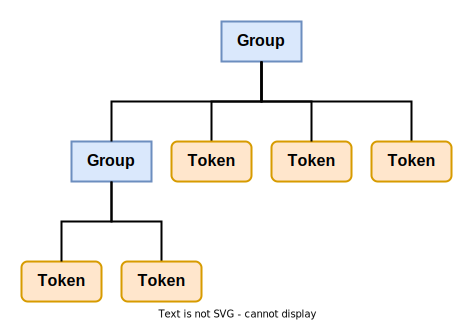
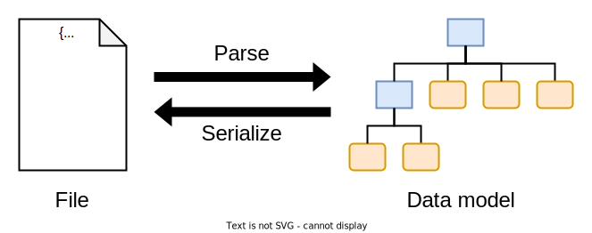

# Data model

There are 2 kinds of entities that this spec defines: Groups and design tokens. Together, they form a tree data structure. The root node is always a group. Group nodes can contain child nodes which are either other groups or design tokens. Design tokens nodes cannot have children and are therefore always leaf nodes.

<figure>

  <figcaption>Visual representation of an example tree structure consisting of group and design token nodes</figcaption>
</figure>

The file format defined by this specification is a serialisation of that data structure.

<figure>

  <figcaption>Illustration of the relationship between a design token file and the corresponding data model</figcaption>
</figure>
