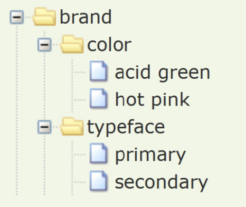

# Groups

A file MAY contain many tokens and they MAY be nested arbitrarily in groups like so:

<aside class="example">

```json
{
  "token uno": {
    "$type": "color",
    "$value": {
      "colorSpace": "srgb",
      "components": [0.07, 0.07, 0.07]
    }
  },
  "token group": {
    "token dos": {
      "$value": { "value": 2, "unit": "rem" },
      "$type": "dimension"
    },
    "nested token group": {
      "token tres": {
        "$value": 33,
        "$type": "number"
      },
      "Token cuatro": {
        "$value": 444,
        "$type": "fontWeight"
      }
    }
  }
}
```

</aside>

The names of the groups leading to a given token (including that token's name) are that token's _path_, which is a computed property. **It is not specified in the file**, but parsers that conform to this spec MUST be able to expose the path of a token. The above example, therefore, defines 4 design tokens with the following properties:

- Token #1
  - Name: "token uno"
  - Path: "token uno"
  - Value: { "colorSpace": "srgb", "components": [17, 17, 17] }
  - Type: "color"
- Token #2
  - Name: "token dos"
  - Path: "token group" / "token dos"
  - Value: { "value": 2, "unit": "rem" }
  - Type: "dimension"
- Token #3
  - Name: "token tres"
  - Path: "token group" / "nested token group" / "token tres"
  - Value: 33
  - Type: "number"
- Token #4
  - Name: "token cuatro"
  - Path: "token group" / "nested token group" / "token cuatro"
  - Value: 444
  - Type: "fontWeight"

Because groupings are arbitrary, tools MUST NOT use them to infer the type or purpose of design tokens.

Groups items (i.e. the tokens and/or nested groups) are unordered. In other words, there is no implicit order between items within a group. Therefore, tools that parse or write design token files are not required to preserve the source order of items in a group.

The names of items in a group are case sensitive. As per the guidance in the [design token chapter](#name-and-value), tools MAY display a warning to users when groups contain items whose names differ only in case and could therefore lead to naming clashes when exported.

<p class="ednote" title="Naming practices">
  The format editors acknowledge existing best-practices for token naming, but place no direct constraints on naming via the specification.
</p>

## Additional group properties

<div class="ednote" title="Group properties vs. nested group and token names">

To prevent collisions with token names, token properties are prefixed with a dollar sign (`$`). Using this prefix eliminates the need for a reserved words list and helps future-proof the spec.

Group keys without a dollar sign (`$`) prefix denote:

- **A token name:** distinguishable by containing a `$value` property

  ```json
  {
    "Group of tokens": {
      "$description": "This is an example of a group containing a single token",
      "Token name": {
        "$value": {
          "colorSpace": "srgb",
          "components": [0, 0, 0]
        }
      }
    }
  }
  ```

- **A nested group name:** distinguishable by _not_ having a `$value` property

  ```json
  {
    "Group of tokens": {
      "$description": "This is an example of a group containing a nested group",
      "Subgroup of tokens": {
        "Token 1 name": {
          "$type": "color",
          "$value": {
            "colorSpace": "srgb",
            "components": [0.667, 0.733, 0.8]
          }
        },
        "Token 2 name": {
          "$type": "color",
          "$value": {
            "colorSpace": "srgb",
            "components": [0.867, 0.933, 1]
          }
        }
      }
    }
  }
  ```

</div>

### Description

Groups MAY include an optional `$description` property, whose value MUST be a plain JSON string. Its purpose is to describe the group itself.

For example:

<aside class="example">

```json
{
  "brand": {
    "$description": "Design tokens from our brand guidelines",
    "color": {
      "$description": "Our brand's primary color palette",
      "acid green": {
        "$type": "color",
        "$value": {
          "colorSpace": "srgb",
          "components": [0, 1, 0.4]
        }
      },
      "hot pink": {
        "$type": "color",
        "$value": {
          "colorSpace": "srgb",
          "components": [1, 0, 1]
        }
      }
    }
  }
}
```

</aside>

Suggested ways tools MAY use this property are:

- A style guide generator could render a section for each group and use the description as an introductory paragraph
- A GUI tool that lets users browse or select tokens could display this info alongside the corresponding group or as a tooltip
- Translation tools could output this as a source code comment

### Type

Groups MAY include an optional `$type` property so a type property does not need to be manually added to every token. [See supported "Types"](#types) for more information.

If a group has a `$type` property it acts as a default type for any tokens within the group, including ones in nested groups, that do not explicitly declare a type via their own `$type` property. For the full set of rules by which a design token's type is determined, please refer to the [design token type property chapter](#type-0).

For example:

<aside class="example">

```json
{
  "brand": {
    "$type": "color",
    "color": {
      "acid green": {
        "$value": {
          "colorSpace": "srgb",
          "components": [0, 1, 0.4]
        }
      },
      "hot pink": {
        "$value": {
          "colorSpace": "srgb",
          "components": [1, 0, 1]
        }
      }
    }
  }
}
```

</aside>

### Extensions

Groups MAY include an optional `$extensions` property where tools MAY add proprietary, user-, team- or vendor-specific data to a group. When doing so, each tool MUST use a vendor-specific key whose value MAY be any valid JSON data.

Group extensions follow the same rules as [design token extensions](#extensions), the only difference is that they relate to the group itself.

- The keys SHOULD be chosen such that they avoid the likelihood of a naming clash with another vendor's data. The [reverse domain name notation](https://en.wikipedia.org/wiki/Reverse_domain_name_notation) is recommended for this purpose.
- Tools that process design token files MUST preserve any extension data they do not themselves understand. For example, if a group contains extension data from tool A and the file containing that data is opened by tool B, then tool B MUST include the original tool A extension data whenever it saves a new design token file containing that group.

Note that, since a group's `$extensions` only relate to that group, they do not have any effect on nested groups or tokens.

<aside class="example">

```json
{
  "brand": {
    "$extensions": {
      "org.example.tool-a": 42,
      "org.example.tool-b": {
        "turn-up-to-11": true
      }
    },
    "color": {
      "acid green": {
        "$type": "color",
        "$value": {
          "colorSpace": "srgb",
          "components": [0, 1, 0.4]
        }
      },
      "hot pink": {
        "$type": "color",
        "$value": {
          "colorSpace": "srgb",
          "components": [1, 0, 1]
        }
      }
    }
  }
}
```

In this example, the "brand" group has 2 extensions: `org.example.tool-a` and `org.example.tool-b`.

</aside>

### Deprecated

The **`$deprecated`** property MAY be used to mark a group as deprecated, which extends to all child tokens within. This property may also optionally give a reason.

<aside class="example">

```json
{
  "Button": {
    "$deprecated": "Please use tokens in the Action group instead.",
    "Foreground": { "$value": "#202020", "$type": "color" },
    "Background": { "$value": "#ffffff", "$type": "color" }
  }
}
```

</aside>

In the context of a group, adding `$deprecated` will apply to all tokens within that group, unless a token explicitly sets a value of `false`. Any value provided by a token will override the group default.

| Value    | Explanation                                                 |
| :------- | :---------------------------------------------------------- |
| `true`   | This token is deprecated (no explanation provided).         |
| `String` | This token is deprecated AND this is an explanation.        |
| `false`  | This token is NOT deprecated (may override group defaults). |

## Use-cases

### File authoring & organization

Groups let token file authors better organize their token files. Related tokens can be nested into groups to align with the team's naming conventions and/or mental model. When manually authoring files, using groups is also less verbose than a flat list of tokens with repeating prefixes.

For example:

<aside class="example">

```json
{
  "brand": {
    "color": {
      "$type": "color",
      "acid green": {
        "$value": {
          "colorSpace": "srgb",
          "components": [0, 1, 0.4]
        }
      },
      "hot pink": {
        "$value": {
          "colorSpace": "srgb",
          "components": [1, 0, 1]
        }
      }
    },
    "typeface": {
      "$type": "fontFamily",
      "primary": {
        "$value": "Comic Sans MS"
      },
      "secondary": {
        "$value": "Times New Roman"
      }
    }
  }
}
```

</aside>

...is likely to be more convenient to type and, arguably, easier to read, than:

<aside class="example">

```json
{
  "brand-color-acid-green": {
    "$type": "color",
    "$value": {
      "colorSpace": "srgb",
      "components": [0, 1, 0.4]
    }
  },
  "brand-color-hot-pink": {
    "$type": "color",
    "$value": {
      "colorSpace": "srgb",
      "components": [1, 0, 1]
    }
  },
  "brand-typeface-primary": {
    "$value": "Comic Sans MS",
    "$type": "fontFamily"
  },
  "brand-typeface-secondary": {
    "$value": "Times New Roman",
    "$type": "fontFamily"
  }
}
```

</aside>

### GUI tools

Tools that let users pick or edit tokens via a GUI MAY use the grouping structure to display a suitable form of progressive disclosure, such as a collapsible tree view.

<figure id="figure-group-progressive-disclosure">
  
  <figcaption>Progressive disclosure groups</figcaption>
</figure>

### Translation tools

Token names are not guaranteed to be unique within the same file. The same name can be used in different groups. Also, translation tools MAY need to export design tokens in a uniquely identifiable way, such as variables in code. Translation tools SHOULD therefore use design tokens' paths as these _are_ unique within a file.

For example, a [=translation tool=] like [Style Dictionary](https://amzn.github.io/style-dictionary/) might use the following design token file:

<aside class="example">

```json
{
  "brand": {
    "color": {
      "$type": "color",
      "acid green": {
        "$value": {
          "colorSpace": "srgb",
          "components": [0, 1, 0.4]
        }
      },
      "hot pink": {
        "$value": {
          "colorSpace": "srgb",
          "components": [1, 0, 1]
        }
      }
    },
    "typeface": {
      "$type": "fontFamily",
      "primary": {
        "$value": "Comic Sans MS"
      },
      "secondary": {
        "$value": "Times New Roman"
      }
    }
  }
}
```

</aside>

...and output it as Sass variables like so by concatenating the path to create variable names:

<aside class="example">

```scss
$brand-color-acid-green: #00ff66;
$brand-color-hot-pink: #ff00ff;
$brand-typeface-primary: 'Comic Sans MS';
$brand-typeface-secondary: 'Times New Roman';
```

</aside>
